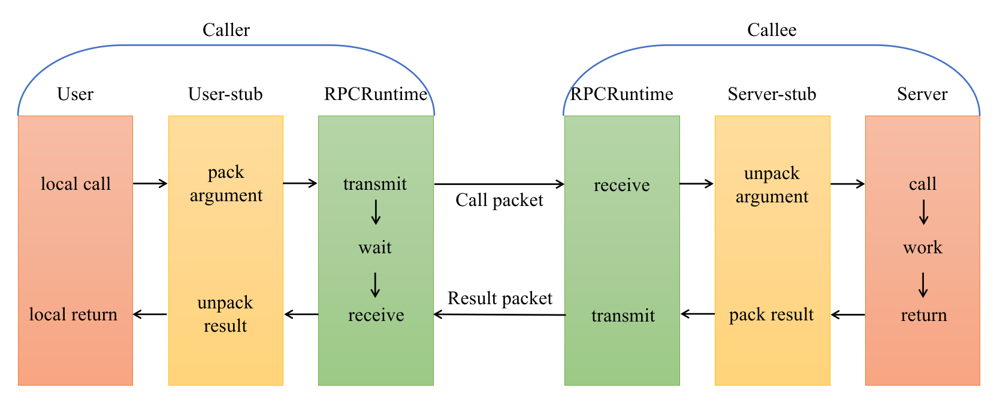

# 分布式网络通信框架

## 项目环境

- 操作系统 Ubuntu 20.04
- cmake 3.22.1
- g++(Ubuntu 11.2.0-19ubuntu1) 11.2.0
- protoc 3.20.3
- muduo库
- zookeeper 3.4.10

## 项目文件说明

- data : README.md的图片
- example : 举例如何使用本项目
- lib : 项目库文件
- src : 源码目录
    + include : 头文件
- test : 测试文件
- CMakeLists : cmake文件
- start.sh : 启动项目的脚本

## 项目原理

### RPC通信原理

- 黄色部分: 设计rpc方法参数的打包和解析,也就是数据的序列化与反序列化,使用的是protobuf
- 绿色部分: 网络通信,包括寻找rpc服务主机,发起rpc调用请求与响应rpc调用结果, 使用muduo网络库和zookeeper服务配置中心

### 项目代码交互

## 代码运行

创建build和bin文件夹, 并生成可执行文件

> mkdir build bin  
> cd build  
> cmake ..  
> make  
> cd ../bin

创建配置文件(test.conf)
> #rpc节点的ip地址  
> rpcserverip=127.0.0.1  
> #rpc节点的端口号  
> rpcserverport=8000  
> #zk的ip地址  
> zookeeperip=127.0.0.1  
> #zk的端口号  
> zookeeperport=2181  

运行测试

> ./provider -i test.conf  
> ./consumer -i test.conf